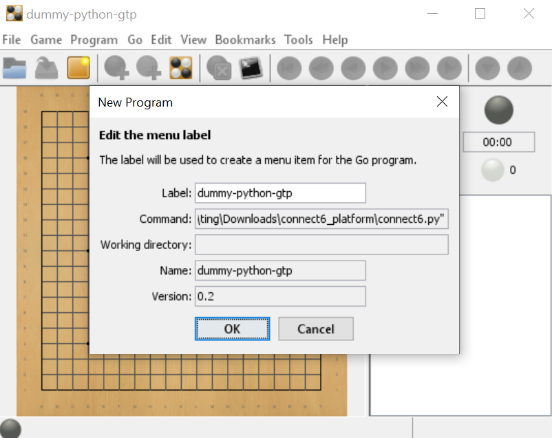

# Playing Connect6 on GoGui

This repository is a modification of [GoGui](https://github.com/Remi-Coulom/gogui) that handles Connect6. GoGui is a graphical interface that allows programs that follow the [GTP protocol](http://www.lysator.liu.se/~gunnar/gtp/) to be displayed in a easily viewable format. In addition, programs that use GTP may easily play against each other, among other handy features.

More specifically, this repository contains two main components.

1. A dummy player that randomly chooses empty points to play at every turn.

2. The required [GTP](http://www.lysator.liu.se/~gunnar/gtp/) commands to [extend rules](https://www.kayufu.com/gogui/rules.html) so that [GoGui](https://github.com/Remi-Coulom/gogui) can support Connect6.

Both components are contained in `connect6.py`.

# Usage instructions
## Setting up GoGui

1. Download the [latest release](https://github.com/Remi-Coulom/gogui/releases/latest) from the official GoGui repository on Github. Extract it to somewhere like `./gogui`.

2. The executables are in `./gogui/lib`. You need to install a [Java Runtime Environment](https://www.java.com/) to run GoGui. We will be running `./gogui/lib/gogui.jar`.

3. For Linux users, you may run `./gogui/bin/gogui`. For Windows users, just double-click `./gogui/lib/gogui.jar`.

4. Return to your home directory (`./`) and download this repo (e.g. `git clone xxx`).

5. To test the provided dummy player, use 'Program' -> 'New Program' in GoGui. Under 'Command', find `./connect6_platform/connect6.py` (or wherever you placed the repo). If you cannot run it properly, try `python ./connect6_platform/connect6.py` or the appropriate variation that is dependent on your environment (it might be `python3`, or the path might be different, etc.)

6. Your screen should look like this upon success:

7. You can now let the random player play against itself by selecting 'Game' -> 'Computer Color' -> 'Both'.

## Writing your own program

You can write your program in any language you prefer, as long as it follows the GTP protocol. Specifically, you need to implement at the very minimum [these commands](https://www.lysator.liu.se/~gunnar/gtp/gtp2-spec-draft2/gtp2-spec.html#SECTION00071000000000000000).

Refer to `connect6.py` for reference if necessary.

Note that if you do not implement the commands that define Connect6 rules (`gogui-rules_xxxx`), GoGui will assume your program plays Go. You can fix this by selecting 'Game' -> 'Rules' -> 'Attach' -> 'dummy_python_gtp' (this is the name of the dummy player in this repo).

# GoGui で Connect6 をプレイする
このリポジトリは、Connect6 に対応するように [GoGui](https://github.com/Remi-Coulom/gogui) を改造したものです。GoGui は [GTP プロトコル](http://www.lysator.liu.se/~gunnar/gtp/) に準拠したプログラムを、分かりやすい形式で表示できるグラフィカルインターフェースです。さらに、GTP を使うプログラム同士を簡単に対戦させることもでき、その他便利な機能が備わっています。

具体的には、このリポジトリには２つの主要な部分が含まれています。

1. 各ターンで適当に打つダミープレイヤー
2. GoGui が Connect6 をサポートできるようにするための、GTP による[ルール拡張コマンド](https://www.kayufu.com/gogui/rules.html)

これらのコンポーネントはすべて`connect6.py`に含まれています。

# 使用方法
## GoGui の設定
1. 公式の GoGui リポジトリから[最新リリース](https://github.com/Remi-Coulom/gogui/releases/latest)をダウンロードしてください。適当な場所(例：`./gogui/`)に展開します。
2. 実行ファイルは`./gogui/lib`にあります。GoGui を実行するには [Java Runtime Environment](https://www.java.com/) をインストールする必要があります。`./gogui/lib/gogui.jar` を実行してください。
3. Linux ユーザーは `./gogui/bin/gogui` を実行しても同じです。Windows ユーザーは単に `./gogui/jar/gogui.jar` をダブルクリックしてください。
4. ホームディレクトリ(例：`./`)に戻り、このリポジトリをダウンロードしてください（例：`git clone xxxx`）。
5. ダミープレイヤーを試すには、GoGuiのメニューから「Program」->「New Program」を選択し、「Command」で`./connect6_platform/connect6.py`（リポジトリを置いた場所）を指定してください。正しく実行できない場合は、`python ./connect6_platform/connect6.py`や`python3`など、環境に依存するコマンドで試してください。
6. 成功すると画面は次のようになります：
7. 「Game」->「Computer Color」->「Both」を選ぶことで、ランダムプレイヤー同士を対戦させることができます。

## 自分のプログラムを書く
プログラムは任意の言語で実装できますが、GTP プロトコルに従う必要があります。特に、最低限[こちらのコマンド](https://www.lysator.liu.se/~gunnar/gtp/gtp2-spec-draft2/gtp2-spec.html#SECTION00071000000000000000)を実装する必要があります。

必要に応じて `connect6.py` を参考にしてください。

なお、Connect6 のルールを定義するコマンド（`gogui-rules_xxxx`）を実装しない場合、GoGui はそのプログラムを囲碁プレイヤーだと見られてしまいます。その場合は、メニューから「Game」->「Rules」->「Attach」->「dummy_python_gtp」（このリポジトリに含まれているダミープレイヤーの名前）を選択することで修正できます。